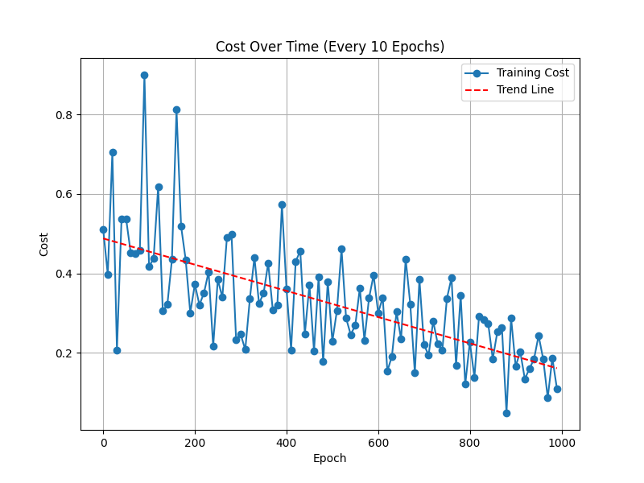
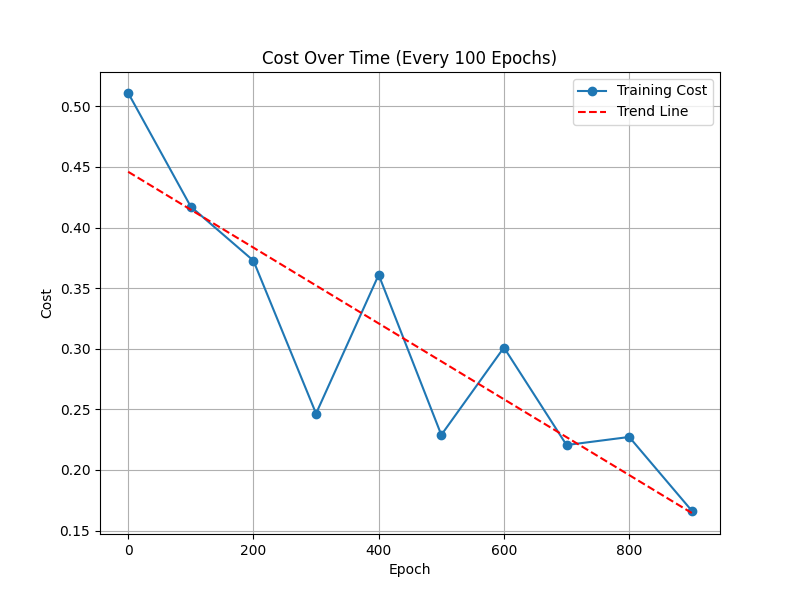

# NFL-AI

### Usage
After cloning, install the necessary packages using:
~~~
pip install -r requirements.txt
~~~

To test the neural network and feature engineering individually, run the 'nn_test.py'
and 'test_feature_engineering.py' files. 

To test the betting system as a whole, run the 'test_betting_system.py' file.

### Data
**Historic NFL Data** *(https://www.kaggle.com/datasets/tobycrabtree/nfl-scores-and-betting-data)*

- Kaggle dataset comprised of the majority of NFL football games dating back to 1966 with 25 unique features for each game.
- Games taking place prior to the 2010-2011 season were taken out.
- Irrelevant and/or noisy potential indicators were removed.

### Line Generation Neural Network
**Neural Network Input Initialization**
- layers - Specifies the number of neurons in each layer and the configuration of neurons.
- activation - Activation function for hidden layers.
- output_activation - Activation function for output layer.
- learning - Network learning rate.
- beta - Momentum coefficient

**Neural Network Component Initialization**
- params - Initializes weights and biases using He Initialization.
- velo - Initializes velocity calculation for momentum optimization.

**Caching and Storage**
- params - Stores weights and biases.
- cache - Stores intermediate calculations.
- gradient - Stores computed gradients.

**Forward Propagation**
- Inputs 'X' are transposed onto a matrix as:
~~~
A = X.T
self.cache['A0'] = A
~~~
- Input and updated weight matrix's are multiplied and bias is added:
~~~
Z = np.dot(W, A) + b
~~~
- Output is ran through the chosen activation function:
~~~
A = self.activation_func(Z)
~~~
- Cache the new input matrix 'A' and dot product + bias result 'Z':
~~~
self.cache['A' + str(layer)] = A
self.cache['Z' + str(layer)] = Z
~~~
- Calculate the cost of each iteration with the Mean Squared Error (MSE) cost function:

**Cost Graphs Over Epochs**

 